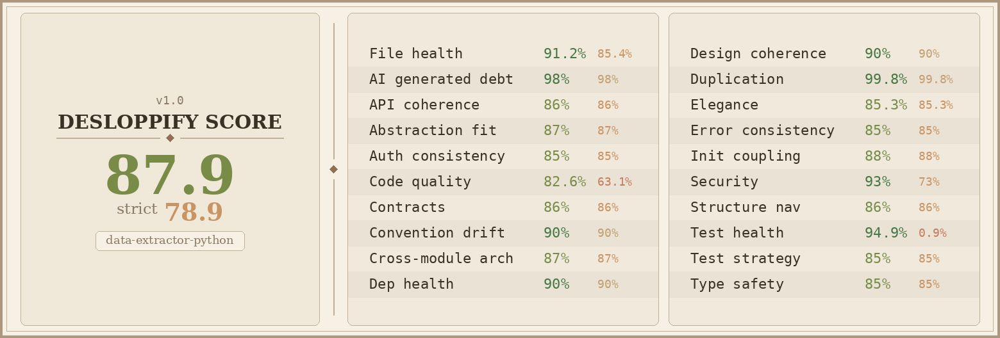

# AetherOmni

AetherOmni is a secure, high-performance web application and background worker architecture designed for semantic document extraction, RAG querying, and memory-grounded Q&A.



<!-- auto:badges -->
[](https://github.com/lucivskvn/AetherOmni)
[](#)
[](#)
<!-- /auto:badges -->

---

## 🚀 Key Features

* **Grounded RAG Pipeline**: Combines document chunking, text-embedding-004 vector embeddings, SurrealDB KV caching, and **Google Gemini 3.5 Flash** models for accurate, context-bound Q&A.
* **Modern LLM Stack**: Migrated to Gemini 3.x generation, using **Gemini 3.5 Flash** as the primary workhorse and **Gemini 3.1 Flash-Lite** for budget-optimized tasks.
* **SurrealDB Vector Memory**: Maintains long-term user style and formatting preferences directly within SurrealDB (replacing Mem0) with a token-saving write gate and strict multi-tenant isolation.
* **Batched Database Insertion**: Optimized SurrealDB ingestion with batched payloads to prevent HTTP 413 errors on large documents.
* **Double-Tier Caching**: Uses exact-match SurrealDB KV caching and cosine-distance vector semantic caching (`RAGQueryCache`) to bypass LLM generation costs for repeated queries.
* **Dual Container Architecture**: Designed for deployment on **Google Cloud Run** as a web handler (`aetheromni-web`) and a steady task queue listener (`aetheromni-worker`).

---

## 🔒 Security & Compliance Frameworks

This project is hardened to comply with leading security standards:

* **SOC 2 Type II (CC7.1, CC7.2)**: Automated vulnerability scanning (SAST and SCA) embedded directly inside the deployment pipelines.
* **ISO 27001 (A.12.6.1, A.14.2.1)**: Formal technical vulnerability management policies and secure development standards.
* **GDPR (Data Minimization & Erasure)**: Short-lived media download links, automated text scrubbing, and dedicated data purge jobs.
* **MITRE ATLAS**: Explicitly protected against AI-specific threats:
  * *AML.T0015 (Prompt Injection)*: Dual-system prompt boundaries and sandbox validations.
  * *AML.T0004 (Data Poisoning)*: Strict file-hash checks and duplicate booklet rejection gates.
  * *AML.T0018 (Adversarial Data Leakage)*: Multi-tenant database boundary partitions.

---

## 🛡️ Pre-Check QA Gates

We use a **7-gate** unified pre-check QA runner to prevent bugs or security leaks from reaching production:

```bash
./run_checks.sh
```

### Gates Description:
1. **Ruff Linter**: Enforces clean Python syntax and coding rules.
2. **Ruff Formatter**: Assures code layout and indent consistency.
3. **Django Integrity**: Verifies database schemas, migrations, and settings validations.
4. **Django Unit Tests**: Executes 158 comprehensive unit tests with coverage generation.
5. **Bandit SAST**: Scans code for security vulnerabilities.
6. **Pip-Audit SCA**: Queries the PyPI database to block any insecure or outdated dependencies.
7. **Auto-Doc Sync**: Refreshes version badges, last-updated stamps, and metadata across all docs.

## 📰 Auto-Updated Documentation

README.md and `gcp_deployment_guide.md` are **never stale**. Every push to `current` triggers a GitHub Actions workflow that:
- Bumps the **version badge** from the canonical `VERSION` file
- Stamps the **last-updated date** and **commit SHA** badge
- Updates the **RELEASE_VERSION** in `service.yaml` / `service-worker.yaml` with the live build timestamp
- Updates **test counts** and **health scores** when they change

You can also run it locally at any time:
```bash
python scripts/update_docs.py
```

---

## 📊 Quality & Code Health Scans

### Desloppify
Run the local code health checks:
```bash
uvx desloppify scan --skip-slow
```
* Current Objective/Mechanical Score: **87.5/100**
* Current Strict Code Health Score: **96.9/100**

### SonarQube
Run the pre-production Sonar scan:
```bash
# 1. Run tests with coverage tracking
DATABASE_URL=sqlite:///db.sqlite3 .venv/bin/python3 -m coverage run --source='.' manage.py test --keepdb
.venv/bin/python3 -m coverage xml -o coverage.xml

# 2. Re-map coverage paths and trigger scanner CLI
./run_sonar_scanner.sh
```

---

## ☁️ Deployment

For detailed production deployment instructions on Google Cloud Run, SurrealDB, Supabase, and Cloud Storage, please refer to the [Google Cloud Run Deployment Guide](gcp_deployment_guide.md).

---

## 📜 License

This project is licensed under the **Universal Software Commons Trust (GNU AGPL-3.0)**. The software is endowed as a perpetual Digital Commons for the collective benefit of all humanity, preventing commercial privatization or boundary restrictions behind network services. For details, see the [LICENSE](LICENSE) file.
