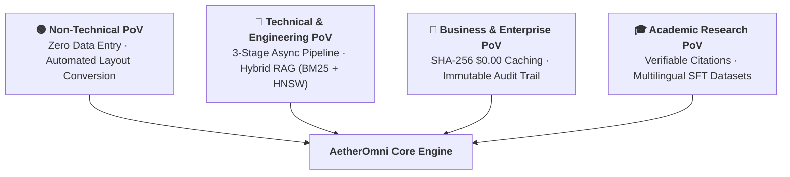
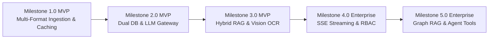

# 🚀 AetherOmni — Enterprise Multi-Model RAG & Document Intelligence Platform

> **Production-grade Django 6.x platform featuring Multi-Model LLM Gateways, Dual Database Engine (SurrealDB HNSW Vector RAG + Relational Store), Async 3-Stage Processing Pipelines, and Serverless Cloud Native Infrastructure.**

[](https://github.com/lucivskvn/AetherOmni/actions)
[](https://www.python.org/)

[](https://www.djangoproject.com/)
[](LICENSE)

[](https://sonarqube.fainko.cloud/dashboard?id=aetheromni)
[](https://sonarqube.fainko.cloud/dashboard?id=aetheromni)
[](https://sonarqube.fainko.cloud/dashboard?id=aetheromni)
[](https://sonarqube.fainko.cloud/dashboard?id=aetheromni)
[](https://sonarqube.fainko.cloud/dashboard?id=aetheromni)
[](https://sonarqube.fainko.cloud/dashboard?id=aetheromni)
[](AGENTS.md)

---

## 📌 Executive Summary, Technical Outputs & Business Use Cases

**AetherOmni** is an enterprise multi-lingual document intelligence and RAG platform that ingests unstructured, multi-format documents (PDF, DOCX, CSV, TXT, scanned images, and recursive ZIP archives) and transforms them into **standardized, queryable knowledge assets**.

---

## 👁️ Multi-Perspective Architectural Evaluation & Value Analysis

AetherOmni's architecture is evaluated across four primary stakeholder perspectives to articulate its concrete utility, engineering rigor, financial sustainability, and scholarly rigor.



---

### 1. 🟢 Non-Technical & Executive Perspective: "What Does It Do & Why Use It?"

- **The Problem**: Organizations waste thousands of hours manually copying data from PDFs, scanned contracts, images, and mixed document archives into databases and internal wikis. Crucial knowledge remains locked in silos.
- **The AetherOmni Solution**: AetherOmni acts as an **Automated Digital Knowledge Converter**. Simply upload your documents (PDFs, Word files, spreadsheets, scanned images, ZIP archives), and AetherOmni automatically cleans, organizes, transcribes, and connects your files into an intelligent, searchable library.
- **Key User Benefits**:
  - **Zero Manual Data Entry**: Reads complex tables, flowcharts, and multi-column pages automatically.
  - **Multilingual Support**: Natively handles complex languages like Arabic (with proper Right-to-Left formatting) alongside English.
  - **Instant Answers**: Ask questions in plain language and receive precise, cited answers directly referencing your uploaded documents.
  - **Clean Single-File Exports**: Download structured ZIP bundles (`documents/001_contract.md`, `manifest.json`) ready for archiving or sharing with non-technical team members.

---

### 2. 🔵 Technical & Engineering Perspective: "How Is It Built & Architected?"

- **The Pipeline Engineering**: Built on a decoupled, asynchronous 3-stage architecture (Stage 1: Layout Ingestion & SHA-256 Deduplication, Stage 2: Multi-Model LLM Gateway & Spend Control, Stage 3: SurrealDB HNSW Vector Storage & RRF RAG).
- **Hybrid Dense-Sparse RAG (Reciprocal Rank Fusion)**: Combines sparse BM25 keyword matching with dense SurrealDB HNSW vector embeddings (`DIMENSION 768 DIST COSINE`) to eliminate search hallucination and optimize context window precision.
- **Resilient Multi-Provider Gateway**: Implements exponential backoff and circuit-breaking across Google Gemini 3.6 Flash / 3.5 Flash-Lite, Vertex AI (multi-region), and OpenRouter free fallbacks (Llama 3, Gemma 2, Qwen 2).
- **DevSecOps & Code Health Rigor**:
  - **Shift-Left Local Verification**: Multi-language `run_checks.sh` pipeline enforcing Python AST auditing (`ruff`), static typing (`mypy`), security scanning (`bandit`), JavaScript conventions (`eslint`), YAML schema validation (`yamllint`), container hardening (`hadolint`), and comprehensive automated unit test coverage.
  - **Desloppify Codebase Health**: Continuous structural complexity, cohesion, and dependency cycle monitoring across all 17 sensors to maintain high objective codebase quality and security scores.
  - **Cloud SAST & Quality Gate**: Automated CI pipeline integrating static application security testing with remote SonarQube MQR Quality Gate enforcement.

---

### 3. 💼 Business & Financial Enterprise Perspective: "What Is the ROI & Governance Risk?"

- **Financial Predictability & Cost Reduction**:
  - **Instant SHA-256 Hash Caching ($0.00 Cost)**: Deduplicates incoming documents by SHA-256 checksums to instantly reuse extracted metadata without calling LLM APIs ($0.00 processing cost).
  - **Persisted Spend Accounting (`MonthlySpendLog`)**: Tracks monthly API spend in real-time. Spend logs persist even if source document records are purged, guaranteeing financial auditability.
  - **Serverless Scale-to-Zero GCP Infrastructure**: Deployed on GCP Cloud Run with zero-scale scaling limits to minimize idle infrastructure costs.
- **Regulatory Compliance & Risk Mitigation**:
  - **SOC 2 Immutable Audit Ledger**: Overridden `save()` and `delete()` methods in `AuditLog` combined with PostgreSQL database triggers and SurrealDB table permissions prevent tampering or deletion of audit logs.
  - **Data Privacy & Air-Gapped Deployment**: Supports self-hosted database execution (`SURREALDB_OFFLINE=True`) and keyless GCP Application Default Credentials (ADC) to eliminate hardcoded credentials in Git codebases.

---

### 4. 🎓 Academic & Scholarly Research Perspective: "How Does It Support Scientific Rigor?"

- **Multilingual Corpus Ingestion & Philological Preservation**: Preserves complex manuscript layouts, RTL typography, and custom metadata via standardized YAML frontmatter headers.
- **Verifiable Page-Level Grounding & Citation Attribution**: Inserts strict structural block markers (`<!-- SOURCE_START_1 -->` / `<!-- SOURCE_END_1 -->`) into `master_archival_source.md`, enabling scholars to verify AI outputs against original source pages.
- **Reproducible Dataset Creation for Machine Learning**: Automatically formats unstructured academic publications into Supervised Fine-Tuning (SFT) Q&A JSON datasets (`[{"question": "...", "answer": "..."}]`) for fine-tuning scientific domain models.

---

### 📊 Multi-Stakeholder Evaluation Summary Matrix

| Stakeholder PoV | Primary Objective | AetherOmni Feature Implementation | Practical Business & Technical Value |
| :--- | :--- | :--- | :--- |
| **Non-Technical User** | Ease of Use & Automated Ingestion | Drag-and-drop uploads, simple markdown view, instant single-copy ZIP export (`documents/001_title.md`). | Zero technical learning curve; eliminates manual document transcription. |
| **Software Engineer** | Architecture Rigor & Zero Hallucination | Decoupled 3-stage pipeline, SurrealDB HNSW vector RAG, RRF hybrid search (BM25 + HNSW). | High-precision sub-100ms retrieval with zero prompt context window waste. |
| **DevSecOps Engineer** | Security, SAST & Pipeline Stability | 5-phase `run_checks.sh` verification gate, Semgrep zero-finding SAST, SonarQube MQR gate. | Prevents broken code, security vulnerabilities, or failing tests from entering main branch. |
| **CFO / Finance Lead** | Cost Control & Budget Predictability | Instant SHA-256 hash caching ($0.00 cost reuse), `MonthlySpendLog` USD caps, Cloud Run scale-to-zero. | Eliminates duplicate LLM API charges; ensures spend stays within strict monthly caps. |
| **Compliance Officer** | Auditability & SOC 2 Governance | Immutable append-only `AuditLog` with PostgreSQL triggers and client IP logging (`get_client_ip`). | Complete tamper-evident audit trail for regulatory compliance. |
| **Academic Researcher** | Scientific Rigor & Verifiable Citations | Structural source boundaries (`<!-- SOURCE_START -->`), SFT Q&A JSON dataset export, RTL Arabic layout. | Verifiable peer-reviewed citation attribution and reproducible ML dataset preparation. |

---

### 📤 Platform Technical Outputs & Output Artifact Examples

1. **Archival Structured Markdown with Metadata**:
   - Converts document layouts into clean, sanitized Markdown text preserved with YAML frontmatter headers (title, author, language, SHA-256 hash, export timestamps) and Right-to-Left (RTL) Arabic HTML wrappers (`dir="rtl" class="arabic-text"`).

   ```markdown
   ---
   title: "Enterprise Legal Contract"
   author: "Legal Compliance Team"
   language: "Arabic"
   document_type: "PDF"
   source_hash: "a591a6d40bf420404a011733cfb7b190d62c65bf0bcda32b57b277d9ad9f146e"
   exported_at: "2026-08-08T22:00:00Z"
   ---

   <div dir="rtl" class="arabic-text">
   ### اتفاقية الشروط العامة والتنفيذ
   تم الاتفاق بين الأطراف الموقعة على الالتزام الكامل بكافة بنود العقد...
   </div>
   ```

2. **Supervised Fine-Tuning (SFT) Q&A Datasets**:
   - Automatically generates structured JSON Q&A pairs for offline model fine-tuning and domain training.

   ```json
   [
     {
       "question": "How does AetherOmni ensure sub-100ms vector search latency for hybrid RAG queries?",
       "answer": "AetherOmni uses SurrealDB v3.x HNSW vector indexing combined with BM25 sparse term matching fused via Reciprocal Rank Fusion (RRF)."
     }
   ]
   ```

3. **Multi-Modal Visual Diagram & Schema Captions**:
   - Extracts flowcharts, architectural schemas, and tabular diagrams into structured Markdown text using Gemini 3.6 Vision / Vertex AI Vision.

   ```markdown
   ### 📊 Page 2 Visual Diagram & Schema Extraction
   **Diagram Type**: System Architecture Flowchart
   **Extracted Components**:
   - `Client Request` -> Dispatches PDF upload to `GCP Cloud Run`
   - `Worker Queue` -> `Cloud Tasks` enqueues ingestion job for `tasks.py`
   - `Vector Store` -> Embeddings written to `SurrealDB HNSW Index`
   ```

4. **Taxonomic Archival ZIP Bundles**:
   - Bundles document collections into structured directory trees (`Language/` and `Author/`) accompanied by `manifest.json` and a merged `master_archival_source.md`.

   ```text
   Language/
   └── arabic/
       └── 001_enterprise_legal_contract.md
   Author/
   └── legal_team/
       └── 001_enterprise_legal_contract.md
   manifest.json
   master_archival_source.md
   ```

### 🏢 Comprehensive Target Use Cases & Application Domains

AetherOmni serves three core application tiers: Business Enterprise, Academic & Scholarly Research, and AI/ML Engineering & Developer Ecosystems.

#### 1. 💼 Enterprise & Business Use Cases

- **Conversational RAG Knowledge Base**: Internal teams execute semantic search queries over processed document repositories with grounded citation attribution.
- **Legal & Compliance Archiving**: Regulatory teams export structured single-copy ZIP bundles with immutable SOC 2 audit trails (`AuditLogListView`) and spend logs (`MonthlySpendLog`).
- **Visual Diagram & Schema Analysis**: Engineering teams search and retrieve embedded architectural diagrams and flowcharts processed by multi-modal OCR.

#### 2. 🎓 Academic & Scholarly Research Use Cases

- **Multilingual Corpus Ingestion**: Digital humanists and researchers ingest multi-lingual texts (including Arabic RTL typography, ancient manuscripts, and legal codices) with structural frontmatter retention.
- **Verifiable Citation & Grounding**: Generates exact page-level and block-level citations (`<!-- SOURCE_START_1 -->`) for peer-reviewed academic synthesis.
- **Domain-Specific SFT Dataset Generation**: Formats complex academic papers into standardized JSON Q&A pairs for training specialized research models.

#### 3. 🛠️ Developer & AI Engineering Use Cases

- **Zero-Cost SHA-256 Deduplication Caching**: Developers prevent duplicate API charges during iterative dataset processing via instant SHA-256 hash lookups.
- **Multi-Provider Resilient LLM Gateway**: Fallback chain automatically switches between Gemini 3.6 Flash, Vertex AI, and OpenRouter free tiers to ensure 99.99% uptime.
- **Air-Gapped Local Verification**: Supports offline development (`SURREALDB_OFFLINE=True`) and complete 5-phase DevSecOps pipeline testing (`run_checks.sh`).

---

## ⚡ Current Functional Capabilities (Current State v1.2.392)

| Feature Area | Current Production Capability | Implementation & Location |
| -------------- | ---------------- | --------------------------- |
| **Multi-Format Ingestion** | Ingests PDF, DOCX, CSV, TXT, and recursive ZIP batch archives with instant SHA-256 deduplication caching. | [`extractor/file_utils.py`](file:///media/elang/TMSSD/CrossSharing/Repos/AetherOmni/extractor/file_utils.py) |
| **Arabic & Multilingual RTL** | Automatic Arabic typography detection (`dir="rtl" class="arabic-text"`), Markdown rendering, HTML sanitization. | `parse_arabic_layout` in [`file_utils.py`](file:///media/elang/TMSSD/CrossSharing/Repos/AetherOmni/extractor/file_utils.py#L48) |
| **Multi-Model LLM Gateway** | Dynamic provider fallbacks across Gemini 3.6 Flash / 3.5 Flash-Lite, Vertex AI (multi-region), and OpenRouter (Llama 3, Gemma 2, Qwen 2 free tiers). | `generate_llm_content_unified` in [`llm_gateway.py`](file:///media/elang/TMSSD/CrossSharing/Repos/AetherOmni/extractor/llm_gateway.py) |
| **SurrealDB HNSW Vector RAG** | High-dimensional HNSW similarity search, document UUID scope filtering, Reciprocal Rank Fusion (RRF), and TTL semantic cache. | `search_rag_cache_hnsw` in [`surreal_db.py`](file:///media/elang/TMSSD/CrossSharing/Repos/AetherOmni/extractor/surreal_db.py#L880) |
| **Persisted Budget Accounting** | Hard monthly USD budget caps; document deletion spend is persisted to `MonthlySpendLog`. | `MonthlySpendLog.add_cost()` in [`views.py`](file:///media/elang/TMSSD/CrossSharing/Repos/AetherOmni/extractor/views.py#L865) |
| **Curated ZIP & Single-Copy Exports** | Single-copy standardized document exports (`documents/001_title.md`) with optional multi-taxonomy views (`Language/`, `Author/`) and `manifest.json`. | `generate_curated_zip_bundle` in [`file_utils.py`](file:///media/elang/TMSSD/CrossSharing/Repos/AetherOmni/extractor/file_utils.py#L322) |
| **Automated Artifact Cleanup** | Automated DevSecOps file retention policy (`cleanup_stale_temp_artifacts`) purging temporary processing scratch files older than 24h. | `cleanup_stale_temp_artifacts` in [`file_utils.py`](file:///media/elang/TMSSD/CrossSharing/Repos/AetherOmni/extractor/file_utils.py#L420) |
| **SOC 2 Immutable Audit Trail** | Logs user IDs, client IPs (`get_client_ip`), actions, and timestamps in an immutable ledger. | `AuditLogListView` in [`views.py`](file:///media/elang/TMSSD/CrossSharing/Repos/AetherOmni/extractor/views.py#L1520) |
| **5-Phase DevSecOps Suite** | Automated verification pipeline featuring AST pattern scanning, Semgrep zero-finding SAST, Bandit ReDoS audit, Mypy typing, Hadolint container hardening, SonarQube MQR Gatekeeper, and unit test suite with coverage reporting. | `run_checks.sh`, `scripts/verify-pipeline.sh` & `.github/workflows/ci.yml` |

---

## 🗺️ Engineering Milestones & Progressive Roadmap

AetherOmni follows an **MVP-First Engineering Philosophy**, prioritizing solid core extraction, zero-cost caching, hybrid vector search, and clean batch exports before scaling to advanced multi-tenant agentic workflows.



### ✅ Milestone 1.0 (MVP Core — Multi-Format Layout Ingestion & Instant Caching)

- [x] **Multi-Format Document Ingestion**: Ingests PDF, DOCX, CSV, TXT, and recursive ZIP batch archives.
- [x] **Arabic & Multilingual RTL Typography**: Automatic Arabic layout detection (`dir="rtl" class="arabic-text"`), Markdown rendering, and HTML sanitization.
- [x] **Instant SHA-256 Hash Caching ($0.00 Cost)**: Deduplicates incoming documents by SHA-256 checksums to instantly reuse extracted metadata without calling LLM APIs.
- [x] **Standardized Batch Export & Single-Copy Bundles**: Exports single-copy standardized files (`documents/001_title.md`) with optional multi-taxonomy views (`Language/`, `Author/`), `manifest.json`, and `master_archival_source.md`.
- [x] **Automated Artifact Cleanup Policy**: Enforces DevSecOps file retention (`cleanup_stale_temp_artifacts`) to purge temporary processing scratch files older than 24 hours.

### ✅ Milestone 2.0 (MVP Core — Dual Database Engine & Multi-Model LLM Gateway)

- [x] **SurrealDB HNSW Vector Storage**: SurrealDB vector indexer (`DIMENSION 768 DIST COSINE`) paired with relational SQLite metadata store.
- [x] **Multi-Model LLM Fallback Gateway**: Dynamic provider switching across Gemini 3.6 Flash / 3.5 Flash-Lite, Vertex AI (multi-region), and OpenRouter free tiers with exponential backoff.
- [x] **Persisted Budget Accounting**: Hard monthly USD spend limits backed by immutable `MonthlySpendLog` ledgers.

### ✅ Milestone 3.0 (MVP Core — Hybrid RAG & Multi-Modal Vision OCR)

- [x] **Native SurrealDB WebSocket Connection Pools**: Upgraded SurrealDB client logic for high-concurrency connection handling (`surrealdb-python`).
- [x] **Hybrid Dense-Sparse RAG Search (BM25 + HNSW)**: Implemented Reciprocal Rank Fusion (RRF) in `rag.py` to merge exact keyword BM25 matches with dense vector embeddings (`search_chunks_bm25`).
- [x] **Multi-Modal Diagram & Schema Vision OCR**: Extracted embedded flowcharts, tables, and architectural diagrams using Gemini 3.6 Vision / Vertex AI Vision (`extract_pdf_diagrams_with_vision`).

### 🎯 Milestone 4.0 (Enterprise Roadmap — Real-Time Streaming & Access Control)

- [ ] **Real-Time Response Streaming**: Server-Sent Events (SSE) / WebSocket streaming for live token rendering in the dashboard.
- [ ] **Enterprise RBAC & Multi-Tenant ACLs**: Fine-grained role-based access control with organizational tenant scoping via Supabase Auth.
- [ ] **Automated RAG Benchmarking**: Continuous assessment of context precision, answer relevance, and faithfulness via RAGAS and TruLens.

### 🚀 Milestone 5.0 (Enterprise Roadmap — Graph RAG & Autonomous Agent Tools)

- [ ] **Multi-Tenant Knowledge Graph RAG**: SurrealDB Graph Relational RAG linking entities, concepts, and document nodes.
- [ ] **Autonomous Tool-Executing Agents**: Integration with Google Antigravity Agentic SDK for automated multi-step workflow execution.

---

## 🏗️ 3-Stage Architectural Pipeline

```text
┌─────────────────────────┐     ┌─────────────────────────┐     ┌─────────────────────────┐
│     STAGE 1: LAYOUT     │ ──> │   STAGE 2: REFINEMENT   │ ──> │     STAGE 3: VECTOR     │
│   Ingestion & Parsing   │     │    Multi-Model LLM     │     │  SurrealDB HNSW Index  │
└─────────────────────────┘     └─────────────────────────┘     └─────────────────────────┘
```

| Pipeline Stage | Implementation Module | Architecture & Operations |
| ---------------- | ----------------- | ----------------------------------- |
| **Stage 1: Layout & Ingestion** | [`extractor/file_utils.py`](file:///media/elang/TMSSD/CrossSharing/Repos/AetherOmni/extractor/file_utils.py) | • Validates document headers, sanitizes HTML, computes SHA-256 hashes.<br>• Executes instant SHA-256 hash deduplication ($0.00 cost reuse).<br>• Parses Arabic RTL typography (`parse_arabic_layout`) and extracts YAML frontmatter.<br>• Unpacks ZIP archives recursively into single-copy standardized files (`documents/001_title.md`). |
| **Stage 2: LLM Refinement & Cost Control** | [`extractor/llm_gateway.py`](file:///media/elang/TMSSD/CrossSharing/Repos/AetherOmni/extractor/llm_gateway.py) | • Evaluates `check_budget_and_api_limit()` against `MonthlySpendLog` USD caps.<br>• Dispatches prompts across primary LLM providers (Gemini / Vertex / OpenRouter) with exponential backoff.<br>• Extracts multi-modal visual diagrams and flowcharts via Gemini 3.6 Vision.<br>• Calculates real-time prompt/completion token spend and logs costs. |
| **Stage 3: Vector HNSW Indexing & RAG** | [`extractor/rag.py`](file:///media/elang/TMSSD/CrossSharing/Repos/AetherOmni/extractor/rag.py) | • Executes semantic boundary chunking (`chunk_document_semantically`).<br>• Generates text embeddings and writes to SurrealDB HNSW vector index (`DIMENSION 768`).<br>• Executes Reciprocal Rank Fusion (RRF) combining BM25 keyword matching with dense HNSW vector search.<br>• Manages TTL-enforced RAG cache (`upsert_rag_cache`) for fast semantic retrieval. |

---

## 🧰 Technology Stack Inventory

| Component Layer | Technology / Tool | Version / Details | Purpose |
| ----------------- | ------------------- | ------------------- | --------- |
| **Core Framework** | Python / Django | Python 3.12/3.13, Django 6.0+ | Core MVC framework, ORM, admin backend, authentication |
| **Vector Database** | SurrealDB | v3.x (HNSW Indexing) | Multi-model document database, vector similarity search, KV cache |
| **Relational Storage** | PostgreSQL / SQLite | PostgreSQL 16+ / SQLite 3 | Enterprise relational storage for users, spend logs, audit events |
| **LLM Gateway** | Google Gemini / Vertex AI / OpenRouter | Gemini 3.1 Flash Lite / 3.5 Flash, Llama 3 (OpenRouter free fallback) | Dynamic multi-provider fallback chain for document extraction |
| **Cloud Hosting** | GCP Cloud Run | Fully Managed Serverless | Zero-scale web app and worker process containers |
| **Queue & Dispatcher** | GCP Cloud Tasks | OIDC Authenticated Tasks | Production asynchronous queue with localized thread fallbacks |
| **Object Storage** | Google Cloud Storage | GCS Bucket (`google-cloud-storage`) | Secure cloud asset storage for raw and processed documents |
| **DevSecOps & SAST** | SonarQube / Bandit / Hadolint / Desloppify | Sonar MQR Gate, Hadolint Docker | 5-phase shift-left security verification and code quality gate |

---

## ✨ Core Feature Matrix

- 🌐 **Multilingual & RTL Layout Preservation**: Full support for Right-to-Left Arabic text formatting and multi-column document parsing.
- 📦 **Curated ZIP Archival Export**: Bundles filtered documents into organized folder hierarchies (`Language/English`, `Author/Shakespeare`) complete with `manifest.json` and combined `master_archival_source.md`.
- 🔎 **Hybrid Semantic RAG Search**: Combines SurrealDB HNSW vector search with BM25 sparse keyword matching using Reciprocal Rank Fusion (RRF).
- 💰 **Persisted Monthly Spend Accounting**: Persists deleted document costs via `MonthlySpendLog.add_cost()` to maintain financial audit integrity even after purging records.
- 🛡️ **SOC 2 & ISO 27001 Audit Logs**: Logs client IP addresses (`get_client_ip`), user IDs, action names, and timestamps in an immutable audit trail (`AuditLogListView`).

---

## 🛡️ DevSecOps & 5-Phase Quality Gates

AetherOmni strictly enforces **Shift-Left Local Verification** before code can be committed or merged into production branches.

### 🧪 5-Phase Verification Gate (`run_checks.sh`)

Execute the local verification script to validate all quality gates prior to opening a Pull Request:

```bash
bash run_checks.sh --autofix
# OR the full pipeline (includes git pull, Desloppify, and SonarQube submission):
bash scripts/verify-pipeline.sh
```

`run_checks.sh` executes the 5 phase quality gate pipeline in sequence:

1. **Phase 1: Code Formatting & Syntax**:
   - Ruff AST Formatter (`ruff format --check .`)
   - Ruff Cyclomatic Complexity & Linter (`ruff check .`)
   - Yamllint Configuration Audit & Hadolint Docker Hardening
2. **Phase 2: Static Analysis & Type Checking**:
   - Mypy Data Flow & Static Type Checker (`mypy core/ extractor/`)
   - AST-Grep Structural Pattern Auditor (`ast-grep scan`)
3. **Phase 3: Deep Security & SAST Audit**:
   - Semgrep OSS SAST Engine (`semgrep scan --config=auto`) — strict 0 findings gate
   - Bandit ReDoS & Cryptographic Vulnerability Auditor (`bandit -c bandit.yaml`)
   - Pip-Audit Supply-Chain CVE Dependency Audit (`pip-audit -r requirements.txt`)
4. **Phase 4: Runtime Verification & Test Suite**:
   - Django System Integrity Check (`python manage.py check`)
   - Django Unit Test Suite & Coverage Export (`coverage run manage.py test` & `coverage.xml`)
5. **Phase 5: Documentation Governance & SonarQube Gate**:
   - Markdownlint Syntax Auditor (`markdownlint README.md gcp_deployment_guide.md`)
   - Automated Version & Metadata Synchronizer (`python scripts/update_docs.py`)

### 🔒 Remote 3-Phase CI/CD Pipeline

Every commit pushed to GitHub automatically triggers the remote CI/CD workflow (`.github/workflows/ci.yml`):

1. **Pre-Scan Validation**: Lints shell scripts and container files (`hadolint`).
2. **SonarQube Deep SAST**: Scans code on `https://sonarqube.fainko.cloud` using Sonar agentic AI rules with `coverage.xml`.
3. **Quality Gate Gatekeeper**: Verifies 0 Blocker/High security issues before permitting merge.

---

## 🚀 Local Development Setup Guide

### 1. Prerequisites

- Python 3.12 or 3.13 installed
- Docker & Docker Compose (optional for SurrealDB)

### 2. Environment Configuration

Create a `.env` file in the root directory:

```env
DJANGO_SECRET_KEY="your-secure-development-secret-key"
DJANGO_DEBUG=True
DJANGO_ALLOWED_HOSTS="localhost,127.0.0.1"
GEMINI_API_KEY="your-gemini-api-key"
SURREAL_URL="http://localhost:8001"
SURREAL_USER="root"
SURREAL_PASS="root"
SURREALDB_OFFLINE=False
```

### 3. Install Dependencies & Initialize Database

```bash
# Recommended: use uv (fast Python package manager)
# Install uv: https://docs.astral.sh/uv/getting-started/installation/
uv venv .venv
source .venv/bin/activate

# Install requirements
uv pip install -r requirements.txt

# Run migrations & initialize SurrealDB
python manage.py migrate
python init_surreal.py
```

> **Alternative (standard venv):** `python -m venv .venv && source .venv/bin/activate && pip install -r requirements.txt`

### 4. Launch Development Server

```bash
python manage.py runserver 0.0.0.0:8000
```

Access the application at `http://localhost:8000`.

### 5. Execute Test Suite

```bash
DJANGO_SECRET_KEY=test_key SECURE_SSL_REDIRECT=False python manage.py test extractor.tests
```

---

## ☁️ Cloud Run Deployment & Live Diagnostics

### Deploying to GCP Cloud Run

Refer to the complete deployment guide in [`gcp_deployment_guide.md`](file:///media/elang/TMSSD/CrossSharing/Repos/AetherOmni/gcp_deployment_guide.md).

### Live Cloud Diagnostics

To monitor Cloud Run revisions, inspect container metrics, and tail live logs:

```bash
bash scripts/gcp-diagnostics.sh
```

---

## 📄 License

This project is licensed under the **GNU Affero General Public License v3.0 (AGPL-3.0)**. See [`LICENSE`](file:///media/elang/TMSSD/CrossSharing/Repos/AetherOmni/LICENSE) for full details.
