# 🚀 AetherOmni — Enterprise Multi-Model RAG & Document Intelligence Platform

> **Production-grade Django 6.x platform featuring Multi-Model LLM Gateways, Dual Database Engine (SurrealDB HNSW Vector RAG + Relational Store), Async 3-Stage Processing Pipelines, and Serverless Cloud Native Infrastructure.**

[](https://github.com/lucivskvn/AetherOmni/actions)
[](https://www.python.org/)
[](https://www.djangoproject.com/)
[](LICENSE)

[](https://sonarqube.fainko.cloud/dashboard?id=aetheromni)
[](https://sonarqube.fainko.cloud/dashboard?id=aetheromni)
[](https://sonarqube.fainko.cloud/dashboard?id=aetheromni)
[](https://sonarqube.fainko.cloud/dashboard?id=aetheromni)
[](https://sonarqube.fainko.cloud/dashboard?id=aetheromni)
[](https://sonarqube.fainko.cloud/dashboard?id=aetheromni)

---

## 📌 Executive Summary & Core Program Goals

**AetherOmni** is an enterprise-grade document extraction, layout parsing, and Retrieval-Augmented Generation (RAG) platform designed for high-concurrency document processing across heterogeneous formats (PDF, DOCX, CSV, TXT, and ZIP archives).

### 🎯 Primary Program Goals & Target Use Cases

1. **Enterprise Document Layout Extraction**:
   - **Use Case**: Legal, historical, and corporate document archiving.
   - **Goal**: Preserve multi-column structures, embedded tables, and Right-to-Left (RTL) Arabic typography (`dir="rtl" class="arabic-text"`) with zero structural loss.

2. **Cost-Controlled Multi-Model LLM Routing**:
   - **Use Case**: Multi-tenant SaaS & high-volume prompt execution.
   - **Goal**: Automatically dispatch prompt execution across Google Gemini 3.6 Flash / 3.5 Flash-Lite, Google Cloud Vertex AI, and OpenRouter (Llama 3 8B, Gemma 2 9B, Qwen 2 7B free tier fallbacks) while enforcing hard monthly USD spend limits (`MonthlySpendLog`).

3. **Ultra-Low-Latency Hybrid Vector RAG**:
   - **Use Case**: Enterprise knowledge bases & automated QA dataset creation.
   - **Goal**: Deliver sub-100ms vector similarity searches using SurrealDB HNSW indexing combined with TTL-enforced semantic cache layers (`upsert_rag_cache`).

4. **Zero-Trust Cloud Serverless Deployment**:
   - **Use Case**: Production deployments requiring high security and autoscaling.
   - **Goal**: Deploy on GCP Cloud Run with OIDC-authenticated Cloud Tasks queues, non-root container isolation (`django-user`), and Knative auto-scaling (`minScale`, `maxScale`).

---

## ⚡ Current Functional Capabilities (Current State v1.2.343)

| Feature Area | Current Production Capability | Implementation & Location |
| -------------- | ---------------- | --------------------------- |
| **Multi-Format Ingestion** | Ingests PDF, DOCX, CSV, TXT, and recursive ZIP batch archives. | [`extractor/file_utils.py`](file:///media/elang/TMSSD/CrossSharing/Repos/AetherOmni/extractor/file_utils.py) |
| **Arabic & Multilingual RTL** | Automatic Arabic typography detection (`dir="rtl" class="arabic-text"`), Markdown rendering, HTML sanitization. | `parse_arabic_layout` in [`file_utils.py`](file:///media/elang/TMSSD/CrossSharing/Repos/AetherOmni/extractor/file_utils.py#L48) |
| **Multi-Model LLM Gateway** | Dynamic provider fallbacks across Gemini 3.6 Flash / 3.5 Flash-Lite, Vertex AI (multi-region), and OpenRouter (Llama 3, Gemma 2, Qwen 2 free tiers). | `generate_llm_content_unified` in [`llm_gateway.py`](file:///media/elang/TMSSD/CrossSharing/Repos/AetherOmni/extractor/llm_gateway.py) |
| **SurrealDB HNSW Vector RAG** | High-dimensional HNSW similarity search, document UUID scope filtering, and TTL semantic cache. | `search_rag_cache_hnsw` in [`surreal_db.py`](file:///media/elang/TMSSD/CrossSharing/Repos/AetherOmni/extractor/surreal_db.py#L880) |
| **Persisted Budget Accounting** | Hard monthly USD budget caps; document deletion spend is persisted to `MonthlySpendLog`. | `MonthlySpendLog.add_cost()` in [`views.py`](file:///media/elang/TMSSD/CrossSharing/Repos/AetherOmni/extractor/views.py#L865) |
| **Curated ZIP Bundling** | Filtered document subset exports organized into `Language/` and `Author/` taxonomies with `manifest.json`. | `generate_curated_zip_bundle` in [`file_utils.py`](file:///media/elang/TMSSD/CrossSharing/Repos/AetherOmni/extractor/file_utils.py#L322) |
| **SOC 2 Immutable Audit Trail** | Logs user IDs, client IPs (`get_client_ip`), actions, and timestamps in an immutable ledger. | `AuditLogListView` in [`views.py`](file:///media/elang/TMSSD/CrossSharing/Repos/AetherOmni/extractor/views.py#L1520) |
| **5-Phase DevSecOps Suite** | Automated 13-gate QA pipeline featuring AST pattern scanning, Semgrep zero-finding SAST, Bandit ReDoS audit, Mypy typing, Hadolint container hardening, SonarQube MQR Gatekeeper, and 184 unit tests with coverage reporting. | `run_checks.sh`, `scripts/verify-pipeline.sh` & `.github/workflows/ci.yml` |

---

## 🗺️ Next Milestones & Roadmap (On Progress / Future)

```mermaid
flowchart LR
    subgraph M2 ["Milestone 2.0 (Completed)"]
        M2A["Dual DB Engine<br>SurrealDB HNSW + Relational"]
        M2B["Multi-Model Gateway<br>Gemini + Vertex AI + OpenRouter"]
        M2C["5-Phase DevSecOps<br>181 Tests + SonarQube Gate"]
    end

    subgraph M3 ["Milestone 3.0 (Completed)"]
        M3A["SurrealDB Native SDK<br>WebSocket Pool Migration"]
        M3B["Hybrid RAG Search<br>BM25 + HNSW RRF Fusion"]
        M3C["Multi-Modal OCR<br>Gemini / Vertex Vision"]
    end

    subgraph M4 ["Milestone 4.0 (Planned Phase)"]
        M4A["Real-time SSE Streaming<br>Chunked Response Delivery"]
        M4B["Enterprise RBAC<br>Tenant Scoped Permissions"]
        M4C["Automated RAG Eval<br>RAGAS & TruLens Pipeline"]
    end

    M2 --> M3 --> M4
```



### ✅ Milestone 3.0 (Completed)

- [x] **Native SurrealDB Python SDK Connection Pools**: Upgraded SurrealDB client logic to support WebSocket connection pooling (`surrealdb-python`).
- [x] **Hybrid Dense-Sparse RAG Search (BM25 + HNSW)**: Implemented Reciprocal Rank Fusion (RRF) in `rag.py` to merge exact keyword BM25 matches with dense vector embeddings (`search_chunks_bm25`).
- [x] **Multi-Modal Diagram & Schema OCR**: Extracted embedded flowcharts, tables, and architectural diagrams using Gemini 3.6 Vision / Vertex AI Vision (`extract_pdf_diagrams_with_vision`).

### 🎯 Milestone 4.0 (Planned — Future Phase)

- [ ] **Real-time Streaming RAG Responses**: Server-Sent Events (SSE) / WebSocket streaming for real-time response rendering in the dashboard.
- [ ] **Enterprise RBAC & Document ACLs**: Fine-grained role-based access control with organizational tenant scoping.
- [ ] **Automated RAG Benchmarking Pipeline**: Integration of RAGAS and TruLens for continuous assessment of context precision, answer relevance, and faithfulness.

---

## 🏗️ 3-Stage Architectural Pipeline

```
┌─────────────────────────┐     ┌─────────────────────────┐     ┌─────────────────────────┐
│     STAGE 1: LAYOUT     │ ──> │   STAGE 2: REFINEMENT   │ ──> │     STAGE 3: VECTOR     │
│   Ingestion & Parsing   │     │    Multi-Model LLM     │     │  SurrealDB HNSW Index  │
└─────────────────────────┘     └─────────────────────────┘     └─────────────────────────┘
```

| Pipeline Stage | Implementation Module | Architecture & Operations |
| ---------------- | ----------------- | ----------------------------------- |
| **Stage 1: Layout & Ingestion** | [`extractor/file_utils.py`](file:///media/elang/TMSSD/CrossSharing/Repos/AetherOmni/extractor/file_utils.py) | • Validates document headers, sanitizes HTML, computes SHA-256 hashes.<br>• Parses Arabic RTL typography (`parse_arabic_layout`) and extracts YAML frontmatter.<br>• Unpacks ZIP archives recursively into structured folder taxonomies (`Language/`, `Author/`). |
| **Stage 2: LLM Refinement & Cost Control** | [`extractor/llm_gateway.py`](file:///media/elang/TMSSD/CrossSharing/Repos/AetherOmni/extractor/llm_gateway.py) | • Evaluates `check_budget_and_api_limit()` against `MonthlySpendLog` USD caps.<br>• Dispatches prompts across primary LLM providers with exponential backoff.<br>• Calculates real-time prompt/completion token spend and logs costs. |
| **Stage 3: Vector HNSW Indexing & RAG** | [`extractor/rag.py`](file:///media/elang/TMSSD/CrossSharing/Repos/AetherOmni/extractor/rag.py) | • Executes semantic boundary chunking (`chunk_document_semantically`).<br>• Generates text embeddings and writes to SurrealDB HNSW vector index.<br>• Manages TTL-enforced RAG cache (`upsert_rag_cache`) for fast semantic retrieval. |

---

## 🧰 Technology Stack Inventory

| Component Layer | Technology / Tool | Version / Details | Purpose |
| ----------------- | ------------------- | ------------------- | --------- |
| **Core Framework** | Python / Django | Python 3.12/3.13, Django 6.0+ | Core MVC framework, ORM, admin backend, authentication |
| **Vector Database** | SurrealDB | v3.x (HNSW Indexing) | Multi-model document database, vector similarity search, KV cache |
| **Relational Storage** | PostgreSQL / SQLite | PostgreSQL 16+ / SQLite 3 | Enterprise relational storage for users, spend logs, audit events |
| **LLM Gateway** | Google Gemini / Vertex AI / OpenRouter | Gemini 3.1 Flash Lite / 3.5 Flash, Llama 3 (OpenRouter free fallback) | Dynamic multi-provider fallback chain for document extraction |
| **Cloud Hosting** | GCP Cloud Run | Fully Managed Serverless | Zero-scale web app and worker process containers |
| **Queue & Dispatcher** | GCP Cloud Tasks | OIDC Authenticated Tasks | Production asynchronous queue with localized thread fallbacks |
| **Object Storage** | Google Cloud Storage | GCS Bucket (`google-cloud-storage`) | Secure cloud asset storage for raw and processed documents |
| **DevSecOps & SAST** | SonarQube / Bandit / Hadolint / Desloppify | Sonar MQR Gate, Hadolint Docker | 5-phase shift-left security verification and code quality gate |

---

## ✨ Core Feature Matrix

- 🌐 **Multilingual & RTL Layout Preservation**: Full support for Right-to-Left Arabic text formatting and multi-column document parsing.
- 📦 **Curated ZIP Archival Export**: Bundles filtered documents into organized folder hierarchies (`Language/English`, `Author/Shakespeare`) complete with `manifest.json` and combined `master_archival_source.md`.
- 🔎 **Hybrid Semantic RAG Search**: Combines SurrealDB HNSW vector search with BM25 sparse keyword matching using Reciprocal Rank Fusion (RRF).
- 💰 **Persisted Monthly Spend Accounting**: Persists deleted document costs via `MonthlySpendLog.add_cost()` to maintain financial audit integrity even after purging records.
- 🛡️ **SOC 2 & ISO 27001 Audit Logs**: Logs client IP addresses (`get_client_ip`), user IDs, action names, and timestamps in an immutable audit trail (`AuditLogListView`).

---

## 🛡️ DevSecOps & 5-Phase Quality Gates

AetherOmni strictly enforces **Shift-Left Local Verification** before code can be committed or merged into production branches.

### 🧪 5-Phase Verification Gate (`run_checks.sh`)

Execute the local verification script to validate all quality gates prior to opening a Pull Request:

```bash
bash run_checks.sh --autofix
# OR the full pipeline (includes git pull, Desloppify, and SonarQube submission):
bash scripts/verify-pipeline.sh
```

`run_checks.sh` executes the 5 phase quality gate pipeline in sequence:

1. **Phase 1: Code Formatting & Syntax**:
   - Ruff AST Formatter (`ruff format --check .`)
   - Ruff Cyclomatic Complexity & Linter (`ruff check .`)
   - Yamllint Configuration Audit & Hadolint Docker Hardening
2. **Phase 2: Static Analysis & Type Checking**:
   - Mypy Data Flow & Static Type Checker (`mypy core/ extractor/`)
   - AST-Grep Structural Pattern Auditor (`ast-grep scan`)
3. **Phase 3: Deep Security & SAST Audit**:
   - Semgrep OSS SAST Engine (`semgrep scan --config=auto`) — strict 0 findings gate
   - Bandit ReDoS & Cryptographic Vulnerability Auditor (`bandit -c bandit.yaml`)
   - Pip-Audit Supply-Chain CVE Dependency Audit (`pip-audit -r requirements.txt`)
4. **Phase 4: Runtime Verification & Test Suite**:
   - Django System Integrity Check (`python manage.py check`)
   - Django 184 Unit Test Suite & Coverage Export (`coverage run manage.py test` & `coverage.xml`)
5. **Phase 5: Documentation Governance & SonarQube Gate**:
   - Markdownlint Syntax Auditor (`markdownlint README.md gcp_deployment_guide.md`)
   - Automated Version & Metadata Synchronizer (`python scripts/update_docs.py`)

```text
Ran 184 tests in 46.737s

OK
```

### 🔒 Remote 3-Phase CI/CD Pipeline

Every commit pushed to GitHub automatically triggers the remote CI/CD workflow (`.github/workflows/ci.yml`):

1. **Pre-Scan Validation**: Lints shell scripts and container files (`hadolint`).
2. **SonarQube Deep SAST**: Scans code on `https://sonarqube.fainko.cloud` using Sonar agentic AI rules with `coverage.xml`.
3. **Quality Gate Gatekeeper**: Verifies 0 Blocker/High security issues before permitting merge.

---

## 📊 SonarQube SAST & Quality Gate Findings

Live analysis reports are automatically ingested from [sonarqube.fainko.cloud](https://sonarqube.fainko.cloud/dashboard?id=aetheromni) on every push and Pull Request.

### 🛡️ SonarQube Software Quality & Security Summary

| Category | Status / Count | Severity / Classification | Mitigation & Resolution Details |
| :--- | :--- | :--- | :--- |
| **Quality Gate** | **PASSED** | Gatekeeper Status | 0 Blocker / 0 Critical issues required for merge. |
| **Security Vulnerabilities** | **0** | High / Blocker | 100% clean (Bandit & Semgrep 0-finding gate enforced). |
| **Security Hotspots** | **4** | Review Required | Hardened with `# nosec B603 / B310` & GCP metadata validation. |
| **Reliability Bugs** | **1** | Low | Scoped with fallback exception handling. |
| **Maintainability (Code Smells)** | **48** | Minor | Non-blocking refactoring (e.g., duplicate string constants). |
| **Unit Test Coverage** | **184 Passing** | Automated Test Suite | Ingested into SonarQube via `coverage.xml` export. |

---

## 🚀 Local Development Setup Guide

### 1. Prerequisites

- Python 3.12 or 3.13 installed
- Docker & Docker Compose (optional for SurrealDB)

### 2. Environment Configuration

Create a `.env` file in the root directory:

```env
DJANGO_SECRET_KEY="your-secure-development-secret-key"
DJANGO_DEBUG=True
DJANGO_ALLOWED_HOSTS="localhost,127.0.0.1"
GEMINI_API_KEY="your-gemini-api-key"
SURREAL_URL="http://localhost:8001"
SURREAL_USER="root"
SURREAL_PASS="root"
SURREALDB_OFFLINE=False
```

### 3. Install Dependencies & Initialize Database

```bash
# Recommended: use uv (fast Python package manager)
# Install uv: https://docs.astral.sh/uv/getting-started/installation/
uv venv .venv
source .venv/bin/activate

# Install requirements
uv pip install -r requirements.txt

# Run migrations & initialize SurrealDB
python manage.py migrate
python init_surreal.py
```

> **Alternative (standard venv):** `python -m venv .venv && source .venv/bin/activate && pip install -r requirements.txt`

### 4. Launch Development Server

```bash
python manage.py runserver 0.0.0.0:8000
```

Access the application at `http://localhost:8000`.

### 5. Execute Test Suite

```bash
DJANGO_SECRET_KEY=test_key SECURE_SSL_REDIRECT=False python manage.py test extractor.tests
```

---

## ☁️ Cloud Run Deployment & Live Diagnostics

### Deploying to GCP Cloud Run

Refer to the complete deployment guide in [`gcp_deployment_guide.md`](file:///media/elang/TMSSD/CrossSharing/Repos/AetherOmni/gcp_deployment_guide.md).

### Live Cloud Diagnostics

To monitor Cloud Run revisions, inspect container metrics, and tail live logs:

```bash
bash scripts/gcp-diagnostics.sh
```

---

## 📄 License

This project is licensed under the **GNU Affero General Public License v3.0 (AGPL-3.0)**. See [`LICENSE`](file:///media/elang/TMSSD/CrossSharing/Repos/AetherOmni/LICENSE) for full details.
